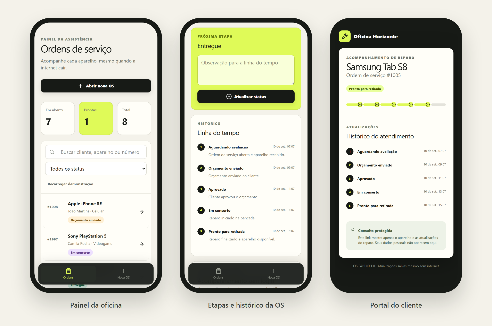
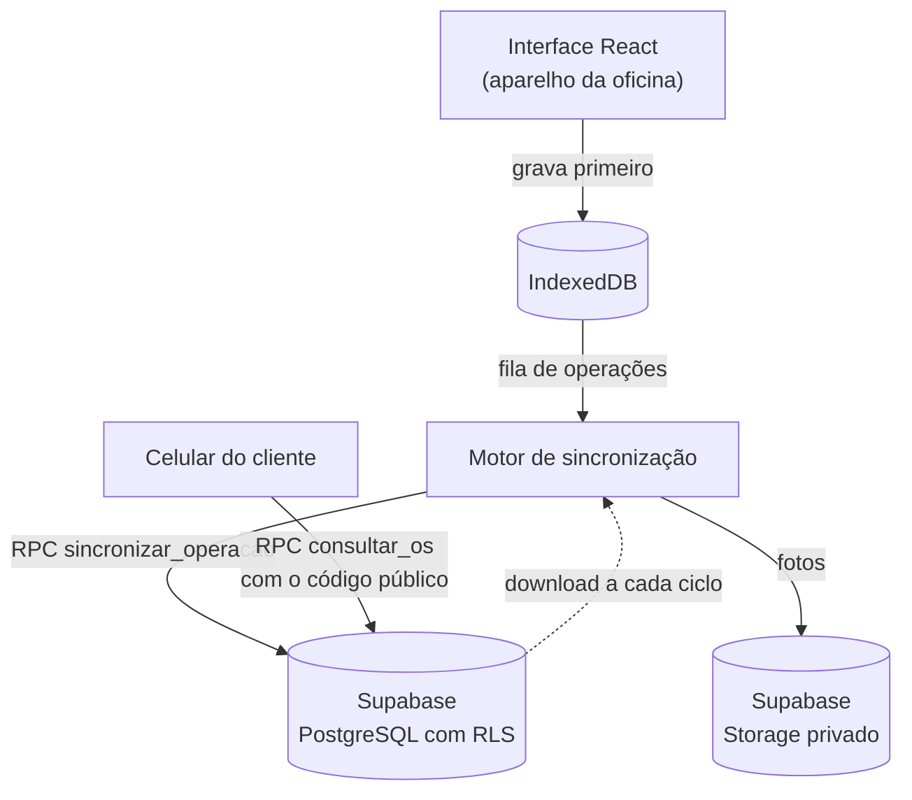

# OS Fácil

Ordens de serviço para assistências técnicas que **continuam funcionando quando a internet cai**. O técnico abre a OS, fotografa o aparelho e colhe a assinatura do cliente sem conexão; as alterações seguem para o servidor quando a rede volta. O cliente acompanha o reparo por um link, sem login.

[](https://github.com/paulo-carvalho10/os-facil/actions/workflows/pages.yml)

**[Abrir a demonstração →](https://paulo-carvalho10.github.io/os-facil/)** · sem cadastro, com dados fictícios, instalável como aplicativo


<p align="center">
  
</p>

## Por que este projeto

Assistência técnica pequena costuma controlar aparelhos em caderno ou planilha, e o cliente liga para perguntar se o conserto ficou pronto. E balcão de loja perde conexão. O OS Fácil grava tudo primeiro no próprio aparelho e trata a internet como algo que pode faltar a qualquer momento: nenhuma tela espera a rede.

## Experimente em dois minutos

1. Abra a [demonstração](https://paulo-carvalho10.github.io/os-facil/) e escolha uma das oito ordens de exemplo.
2. Avance a etapa de uma OS e veja a linha do tempo registrar a mudança.
3. Abra uma OS nova, adicione uma foto e colha uma assinatura.
4. No cartão **Portal do cliente**, clique em **Abrir**: é o que o cliente vê, sem nome, telefone ou fotos.
5. **Desligue a internet e recarregue a página.** Depois da primeira visita, tudo continua funcionando.

A demonstração guarda os dados só no seu navegador. **Recarregar demonstração** restaura os exemplos.

## Destaques técnicos

- **Local-first.** Toda gravação vai primeiro para o IndexedDB, na mesma transação que enfileira a operação de envio. A interface nunca espera o servidor. [Banco local →](ARQUITETURA.md#banco-local)
- **Sincronização que aguenta queda de conexão.** Cada operação tem um UUID, e o servidor guarda um recibo com o hash do conteúdo, então um reenvio depois de uma queda é reconhecido como repetição. Falha de rede interrompe o ciclo e tenta de novo com espera crescente; um dado recusado pelo banco sai do caminho e aparece na tela com o motivo, sem travar o restante da fila. [Envio da fila →](ARQUITETURA.md#envio-da-fila)
- **Conflito sem perda de dado.** O status da OS usa "último horário vence", mas eventos, fotos e assinaturas são só inseridos. Uma assinatura colhida offline não é apagada por uma mudança de status feita depois em outro aparelho, e esse cenário tem teste próprio. [Conflitos →](ARQUITETURA.md#conflitos)
- **Segurança no banco, não na tela.** Nenhuma tabela aceita escrita direta do navegador: tudo passa por uma função que valida e registra a operação. O RLS libera leitura só para operadores autorizados, e o portal público devolve apenas aparelho, número da OS e andamento. [Portal do cliente →](ARQUITETURA.md#portal-do-cliente)

## Funcionalidades

**Para a oficina**

- Abertura de OS com cliente, aparelho, IMEI ou número de série, defeito, acessórios e orçamento, validados no aparelho com os mesmos limites do banco
- Leitura de código de barras pela câmera, quando o navegador oferece suporte
- Busca, filtro por etapa e resumo de aparelhos em aberto e prontos para retirada
- Seis etapas (aguardando avaliação, orçamento enviado, aprovado, em conserto, pronto e entregue) com linha do tempo
- Fotos pela câmera ou pela galeria, reduzidas no navegador antes de salvar
- Assinatura do cliente na tela, com dedo, caneta ou mouse
- Estilos de impressão para A4 e para cupom de 80 mm

**Para o cliente**

- Acompanhamento por link com código aleatório de 16 caracteres, sem login
- Nenhum dado pessoal, foto, assinatura ou observação interna no portal

**Offline e sincronização**

- Instalável como aplicativo e utilizável sem internet
- Na versão conectada: login de operadores autorizados pelo administrador, envio automático quando a conexão volta e uma tela que lista as alterações recusadas pelo servidor, com o motivo

**Uma OS por dentro:** equipamento, foto de entrada, assinatura, próxima etapa e linha do tempo.


## Arquitetura

A interface só conversa com o banco local. Quem fala com o servidor é o motor de sincronização, em segundo plano.



O fluxo completo, a regra de conflitos e os limites estão em [ARQUITETURA.md](ARQUITETURA.md). As migrações, as políticas de acesso e a verificação do banco estão em [SUPABASE.md](SUPABASE.md).

## Stack

| Camada | Tecnologia |
| --- | --- |
| Interface | React 19, TypeScript, Vite, React Router |
| Estilo | CSS próprio, Tailwind CSS 4 e ícones Lucide |
| Offline | Dexie sobre IndexedDB e service worker com vite-plugin-pwa |
| Servidor | Supabase: PostgreSQL, RLS, Auth e Storage |
| Testes | Vitest, fake-indexeddb e scripts SQL de integração |
| Publicação | GitHub Actions e GitHub Pages |

## Rodando localmente

Requer Node.js 24 e pnpm 11. Sem o pnpm instalado, `npx pnpm@11` funciona no lugar de `pnpm`.

```sh
pnpm install
pnpm dev --mode demo   # demonstração, sem servidor
pnpm test
pnpm build:demo
```

Para a versão conectada, copie `.env.example` para `.env.local` com a URL e a chave publicável do seu projeto Supabase, aplique as migrações na ordem descrita em [SUPABASE.md](SUPABASE.md) e rode `pnpm dev`. Nunca coloque chaves secretas em variáveis com prefixo `VITE_`.

## Testes

- **33 testes automatizados** cobrem a validação dos dados, as regras da fila (ordem, dependências, erro definitivo e passageiro), o motor de sincronização contra um servidor em memória que reproduz a RPC (queda de conexão, recusa que não trava a fila, assinatura preservada em conflito), a migração do banco local e os dados de exemplo.
- **No banco:** `supabase/testar-integracao.sql` confere RLS, escrita direta bloqueada, idempotência, privacidade do portal e preservação da assinatura. Ele roda dentro de uma transação desfeita ao final e foi aprovado no projeto Supabase real.
- **No navegador:** a demonstração publicada foi verificada num Chromium: instalável, abre e recarrega sem rede, cria OS, salva assinatura e abre o portal offline.

## Limites conhecidos

- Cada ciclo de sincronização baixa as tabelas inteiras. Com muito volume, o próximo passo é baixar só o que mudou desde o último ciclo.
- O número de uma OS criada offline é provisório até sincronizar; um comprovante impresso antes disso sai com o número provisório.
- Na versão conectada, abrir o painel exige validar a sessão online. Depois de aberto, funciona sem rede.
- Os horários usados nos conflitos vêm do relógio de cada aparelho.
- Ainda não há recuperação de senha na interface nem rotina de backup, e a impressão não foi testada em impressora física.

Estoque, nota fiscal, pagamentos e várias empresas na mesma conta estão fora deste MVP: [V2.md](V2.md).

---

Desenvolvido por [Paulo Carvalho](https://github.com/paulo-carvalho10).
