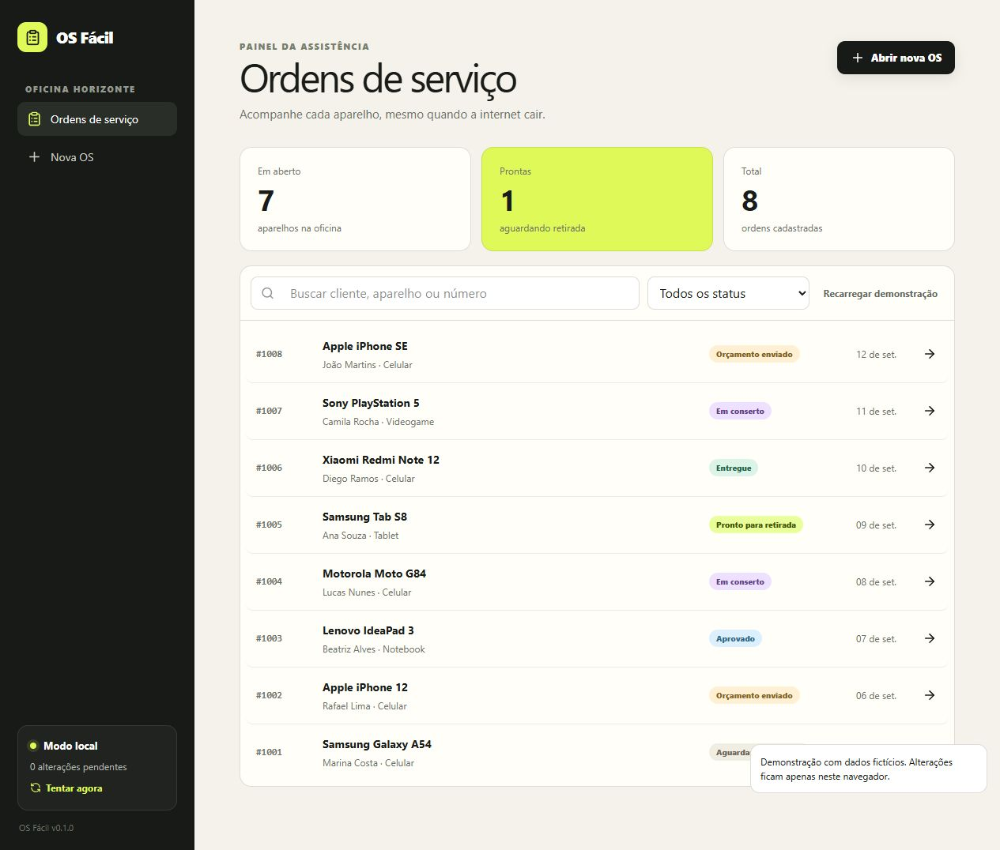

# OS Fácil

Aplicativo web de ordem de serviço para assistências técnicas. A oficina abre e atualiza atendimentos mesmo sem internet; quando uma API é configurada, a fila sincroniza em segundo plano. O cliente acompanha o reparo por um código público não sequencial.



## O que já funciona

- abertura de OS com cliente, aparelho, IMEI, defeito, acessórios e orçamento;
- gravação imediata no IndexedDB com Dexie;
- oito ordens de demonstração em fases diferentes;
- busca por cliente, aparelho ou número e filtro de status;
- esteira completa de seis fases e linha do tempo;
- fotos pela câmera ou galeria, reduzidas antes de salvar como blob;
- leitura de IMEI, número de série ou QR Code pela câmera quando o navegador oferece `BarcodeDetector`;
- assinatura do cliente em canvas;
- portal público em `/os/[codigo]`, sem dados pessoais;
- impressão em A4 e estilo compacto para 80 mm;
- manifest, service worker e modo instalável;
- fila idempotente com repetição exponencial;
- back-end opcional para Supabase;
- layout responsivo para celular e computador.

## Decisões técnicas

O IndexedDB é a fonte imediata da tela: nenhuma escrita espera a rede. Cada alteração gera uma operação idempotente na fila. Fotos continuam como blobs enquanto o dispositivo está offline. Conflitos usam a data de alteração mais recente; mudanças de status criam eventos imutáveis.

O código público usa 16 caracteres aleatórios gerados pela Web Crypto API. Ele não contém o número da OS nem dados do cliente, impedindo a enumeração simples de atendimentos.

Os detalhes estão em [ARQUITETURA.md](./ARQUITETURA.md).

## Executar

Requer Node.js 20 ou superior e pnpm.

```bash
pnpm install
pnpm dev
```

Acesse `http://127.0.0.1:5173`. Para testar o portal, abra uma OS e use o botão **Abrir** no cartão “Portal do cliente”.

## Testes e build

```bash
pnpm test
pnpm build
```

## Sincronização opcional

Sem configuração, a demonstração funciona integralmente no navegador e apresenta o estado “Modo local”. Para conectar um back-end:

1. execute `supabase/schema.sql` e as migrações de `supabase/migrations` em ordem;
2. configure a URL e a chave publicável em `.env.local`, conforme `.env.example`;
3. crie o usuário em Authentication e autorize seu UUID na tabela `operadores` pelo administrador;
4. entre no aplicativo com e-mail e senha. O modo conectado inicia vazio, sem enviar o seed ao servidor.

A integração atual usa Supabase Auth, RPC transacional e Storage privado diretamente. A antiga Edge Function e `src/sync/engine.ts` são protótipos desativados e não devem ser publicados. Consulte [SUPABASE.md](./SUPABASE.md).

Nenhuma chave secreta deve usar o prefixo `VITE_`. A service role pertence somente ao ambiente da Edge Function.

## Privacidade da demonstração

Os nomes, telefones e aparelhos incluídos no seed são fictícios. A demonstração não envia mensagens, e-mails ou cobranças. Sem a configuração do Supabase, os dados permanecem no navegador.

## Limites do MVP

Estoque, nota fiscal, comissão, cobrança, chat e multiempresa estão congelados em [V2.md](./V2.md).

OS Fácil v0.1.0
