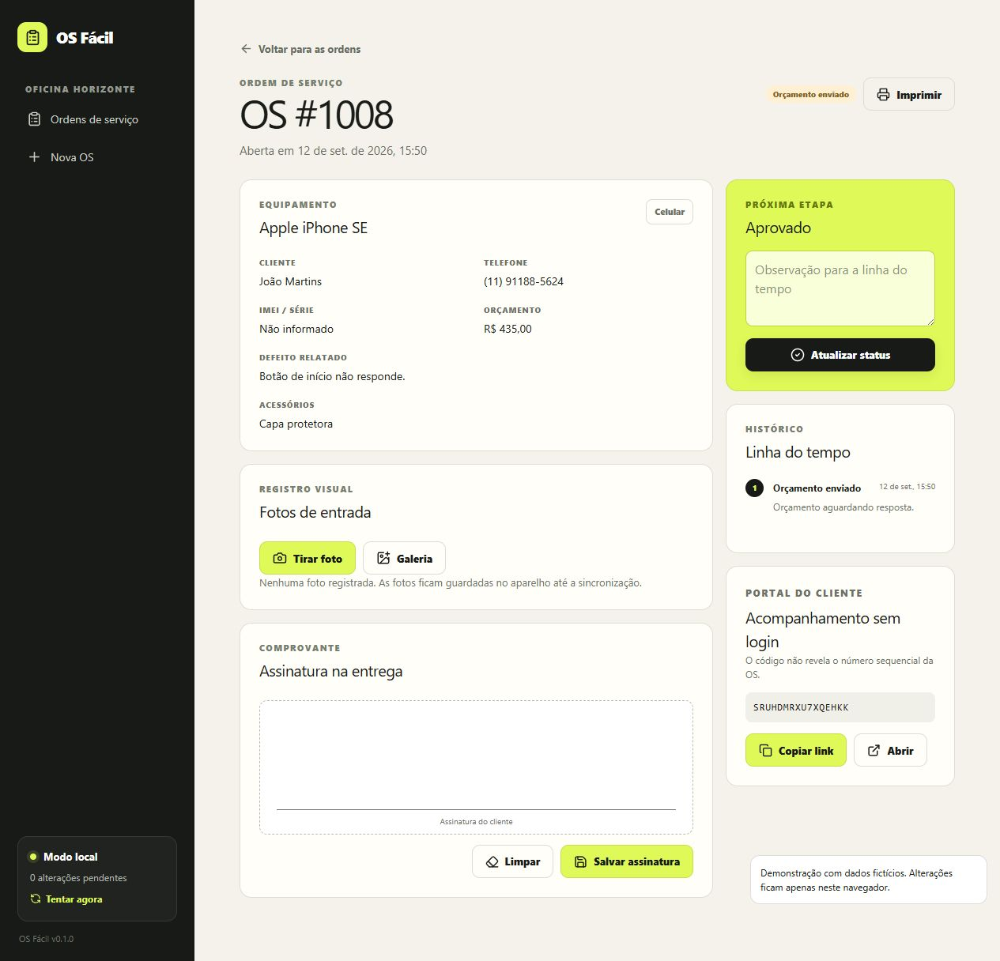
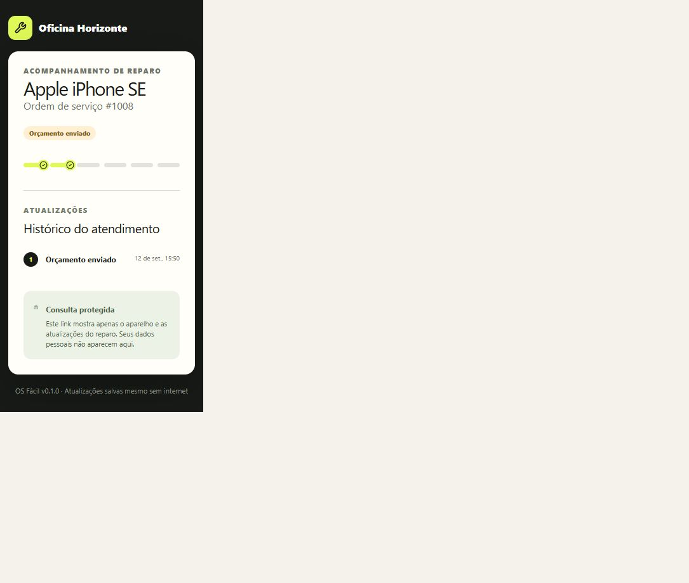

# OS Fácil

Aplicativo de ordens de serviço para assistências técnicas, desenvolvido como projeto de portfólio. Permite cadastrar atendimentos, acompanhar etapas de reparo, registrar fotos e consultar o andamento por um portal do cliente.

**[Abrir demonstração pública](https://paulo-carvalho10.github.io/os-facil/)** · Sem cadastro ou senha.


## Experimente

1. Abra a demonstração e explore as oito ordens fictícias.
2. Busque um cliente ou filtre as ordens por status.
3. Abra uma OS para ver os dados do aparelho e atualizar a etapa.
4. Cadastre uma nova OS, adicione uma foto de teste e explore a impressão.
5. Use **Abrir** no cartão Portal do cliente para visualizar o acompanhamento.
6. **Desligue a internet e recarregue a página.** O painel abre, e dá para abrir OS, avançar etapas e colher assinatura sem rede.
7. Clique em **Recarregar demonstração** para restaurar os exemplos. Isso apaga as alterações locais da demonstração.

A demonstração usa IndexedDB no seu navegador e pode ser instalada como aplicativo. Depois da primeira visita, funciona sem internet. Não envia dados ao Supabase, não exige login e não compartilha alterações entre visitantes. Use apenas dados fictícios. Os links de acompanhamento dessa versão dependem dos dados do mesmo navegador.

## Funcionalidades

- Funciona offline e pode ser instalada como aplicativo (PWA).
- Cadastro de cliente, aparelho, defeito, acessórios e orçamento, validado no aparelho com os mesmos limites do banco.
- Busca, filtros e resumo de atendimentos.
- Seis etapas de reparo e histórico de alterações.
- Fotos pela galeria ou câmera, reduzidas antes de salvar.
- Assinatura em canvas, guardada como registro próprio para não ser apagada por mudanças de status em outro aparelho.
- Estilos de impressão A4 e 80 mm.
- Portal por código aleatório, sem exibir dados pessoais, fotos ou notas internas.
- Leitura de códigos quando o navegador oferece BarcodeDetector.
- Fila de sincronização em que uma alteração recusada pelo servidor não trava as outras e aparece na tela com o motivo.

## Integração com Supabase





O código também inclui uma versão conectada: login por e-mail e senha, autorização de operadores por RLS, fotos privadas e sincronização periódica entre dispositivos. Essa integração foi verificada separadamente com criação de OS, envio de foto e consulta em dois navegadores.

A demonstração pública é compilada em modo `demo`, que desativa o cliente Supabase mesmo se houver configuração local. A versão conectada exige seu próprio ambiente e operadores autorizados. Veja [SUPABASE.md](SUPABASE.md) e [ARQUITETURA.md](ARQUITETURA.md).

## Tecnologias

| Área | Tecnologias |
| --- | --- |
| Interface | React 19, TypeScript, Vite, React Router, Lucide |
| Estilos | CSS e Tailwind CSS 4 |
| Dados locais | Dexie / IndexedDB |
| Backend opcional | Supabase Auth, PostgreSQL, RLS e Storage |
| Verificação | Vitest, fake-indexeddb e testes SQL de integração |
| Publicação | GitHub Pages e GitHub Actions |

## Executar localmente

Requer Node.js 24 e pnpm 11.

```sh
pnpm install
pnpm dev --mode demo
```

Para usar Supabase, configure as variáveis de `.env.example` em `.env.local`, aplique as migrações e execute `pnpm dev`. Nunca coloque chaves secretas em variáveis com prefixo `VITE_`.

```sh
pnpm test
pnpm build:demo
```

O workflow publica a pasta `dist` no GitHub Pages após os testes. Rotas da demonstração usam hash para permitir navegação e recarregamento sem configuração de servidor.

## Validação e limites

32 testes automatizados. Cobrem validação, regras da fila, o motor de sincronização contra um servidor em memória (recusa que não trava a fila, queda de conexão, assinatura preservada em conflito) e a migração do banco local. O script `supabase/testar-integracao.sql` cobre RLS, autorização, escrita direta bloqueada, idempotência, privacidade do portal e preservação da assinatura. Ele passou no projeto Supabase real, com as cinco migrações aplicadas.

A demonstração foi verificada num Chromium: instalável, abre e recarrega sem rede, cria OS, salva assinatura e abre o portal offline. A versão conectada foi verificada no projeto Supabase real: login, criação de OS, envio de foto e sincronização entre dois navegadores. Depois da migração 004, uma assinatura colhida no navegador foi sincronizada e gravada no banco como registro próprio, com o status da OS preservado.

Este é um MVP de portfólio, não um produto pronto para operação comercial. Pendentes: impressão física, recuperação de senha na interface, backup operacional e download incremental (hoje cada ciclo baixa as tabelas inteiras). Na versão conectada, abrir o painel exige validar a sessão online; depois de aberto, funciona sem rede. Câmera e leitura de códigos dependem do navegador e de permissão do visitante. Detalhes em [ARQUITETURA.md](ARQUITETURA.md).

Estoque, nota fiscal, pagamentos e multiempresa estão fora do escopo atual: [V2.md](V2.md).

Desenvolvido por [Paulo Carvalho](https://github.com/paulo-carvalho10).
